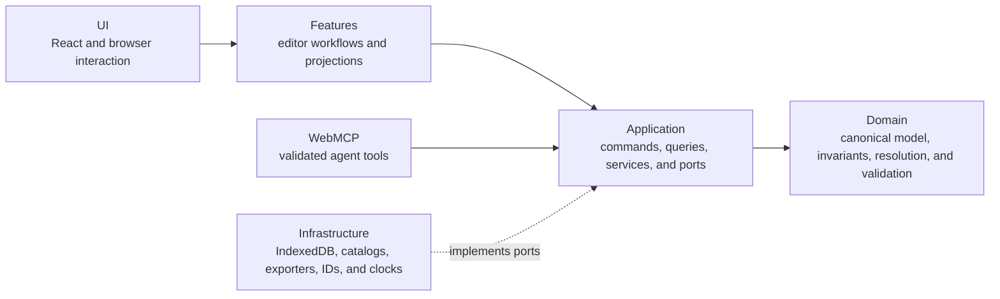

# ArchForge

**An AI-native, local-first workspace for designing system architecture from
requirements instead of vendor defaults.**

ArchForge keeps the reasoning behind a design next to the design itself. Model
the capabilities a system needs, record its requirements and constraints, then
evaluate technologies, providers, and managed services without collapsing them
into one premature choice.

All architecture data stays in IndexedDB in the current browser profile. There
is no backend, account, upload, or remote synchronization in the MVP.

## Vision

Architecture work often jumps from a problem statement directly to a familiar
product name. ArchForge makes the missing reasoning explicit:

`Requirements -> Capabilities -> Architecture -> Technology -> Provider -> Cloud Service`

Each stage is modeled separately. A database capability can exist before it is
resolved to PostgreSQL, AWS, or a particular managed service. Suggestions are
derived from requirements, hard constraints, operational preferences, catalog
data, and explicitly modeled existing infrastructure. They remain advisory,
explainable, and reversible.

This creates one shared, auditable architecture for two ways of working:

- People design through the canvas, evidence panels, inspector, and validation
  feedback.
- Agents design through WebMCP tools that use the same commands and domain
  rules as the UI.

AI activity is visible as provenance, not hidden state. The canonical
architecture remains the source of truth regardless of who made a change.

## What the MVP includes

- A visual editor for provider-neutral components and typed connections.
- Requirements, constraints, operational preferences, and existing
  infrastructure as first-class evidence.
- Representative capability, technology, AWS, Azure, and cloud-service
  catalogs.
- Deterministic, requirement-aware resolution suggestions with reasons,
  tradeoffs, and blocking conflicts.
- Structured validation with actionable issues linked to affected entities.
- Local IndexedDB persistence and multiple local architectures.
- Local JSON, SVG, and PNG export.
- Runtime-validated WebMCP tools for design, resolution, analysis, and export.
- A high-level `design_system` agent workflow with preflight validation and
  visible step-by-step activity.

## How it is built

ArchForge uses a layered architecture with dependencies pointing inward:



The key boundaries are:

- **Domain:** a framework-free `Architecture` aggregate containing metadata,
  requirements, constraints, components, connections, decisions, and revision
  timestamps.
- **Application:** typed commands and queries. Every mutation—whether initiated
  by a person or an agent—passes through the same application services.
- **Infrastructure:** implementations for persistence, immutable catalogs,
  export, IDs, and clocks. Persisted and external data is runtime-validated at
  the boundary.
- **Features and UI:** projections of canonical state for the canvas,
  inspectors, evidence, resolution, validation, and activity surfaces.
- **WebMCP:** strict, versioned adapters over application services. Tool code
  does not access React or the DOM.

Durable architecture state is deliberately separate from ephemeral editor
state such as selection, viewport, open panels, and AI activity. Exporters read
validated snapshots and never mutate the design.

For deeper detail, see [the technical architecture](docs/architecture.md),
[product scope](docs/product-scope.md), [contract strategy](docs/contracts.md),
and [WebMCP surface](docs/webmcp.md).

## Run locally

### Requirements

- Node.js 20.9 or newer
- pnpm 10
- A current Chromium-based browser for the supported MVP path

### Start the app

```bash
pnpm install
pnpm dev
```

Open [http://localhost:3000](http://localhost:3000). Create an empty
architecture or choose one of the starter templates. Loading a template creates
a new local record and does not replace existing work.

For a production build:

```bash
pnpm build
pnpm start
```

## Five-minute walkthrough

1. Choose a starter template from the welcome screen.
2. Select a component on the canvas and open **Inspector**.
3. Use **Evidence** to review or add requirements and constraints.
4. Open **Resolution** to compare compatible implementation options, reasons,
   tradeoffs, and unresolved choices.
5. Open **Signals** to inspect deterministic validation and WebMCP activity.
6. Select **Export** and download JSON, SVG, or PNG generated locally from the
   canonical architecture.
7. Reload the page. The architecture persists; selection, viewport, open
   panels, and AI activity do not.

Press **?** in the editor to view keyboard shortcuts. On narrow viewports, the
same architecture tools remain available through the responsive overlays.

## WebMCP support

ArchForge feature-detects the browser's experimental `document.modelContext`
API. When available, it registers strict, versioned tools for architectures,
requirements, components, connections, resolution, validation, review, risk
analysis, export, and the high-level `design_system` workflow. Without WebMCP,
the complete human editing and export path still works; registration is simply
skipped.

WebMCP mutations call the same application services as the UI. The **Signals**
panel records tool name, provenance, status, affected entities, safe errors, and
workflow grouping for the current session.

The `design_system` workflow validates the complete request and an in-memory
domain preview before its first write. It then executes primitive commands in
dependency order. If a later command fails, its structured error identifies the
completed prefix, persisted revision, and recovery context; earlier writes are
retained, and the workflow never claims an atomic rollback.

## Local data and recovery

- Architectures are stored in the `archforge` IndexedDB database for the
  current origin and browser profile.
- Clearing browser site data removes local architectures and cannot be undone
  by the app.
- **Clear canvas** removes design content only after confirmation and preserves
  the architecture record.
- If an unreadable record is detected, recovery removes only corrupt records
  and preserves valid architectures.
- JSON export is a lossless snapshot for the current contract version. Import
  is outside the MVP scope.

## Development

```bash
pnpm lint
pnpm typecheck
pnpm build
```

The repository also contains Vitest integration/unit coverage and Playwright
end-to-end coverage for the configured Chromium path:

```bash
pnpm test
pnpm test:e2e
```

Source modules follow the same dependency boundaries documented above:

```text
src/
  app/             composition root and Next.js entry points
  application/     commands, contracts, ports, and services
  components/      reusable UI and canvas rendering
  domain/          canonical model, resolution, and validation
  features/        editor workflows and view projections
  infrastructure/  IndexedDB, catalogs, and export adapters
  webmcp/          schemas, registration, and tool adapters
```

## MVP boundaries

The MVP is single-user and browser-local. It does not include authentication,
collaboration, cloud persistence, deployment, infrastructure-as-code
generation, cost estimation, live cloud inventory, or automatic vendor
selection. Catalog coverage is representative rather than exhaustive and is
currently focused on common web-system capabilities across AWS and Azure.

Technology and provider scores are decision support, not autonomous choices.
Explicit selections stay visible and auditable in the canonical architecture.
